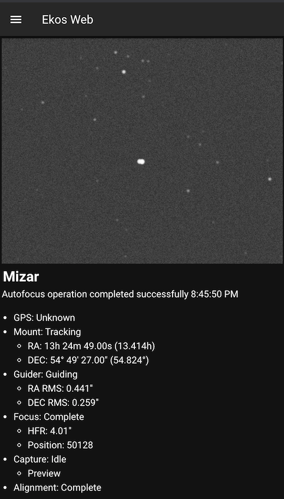
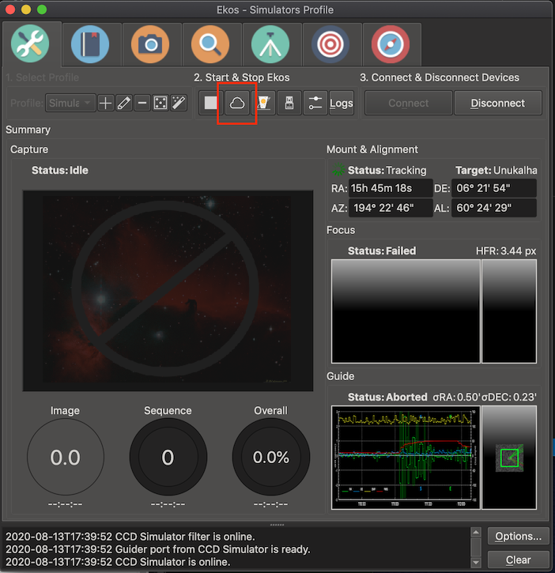
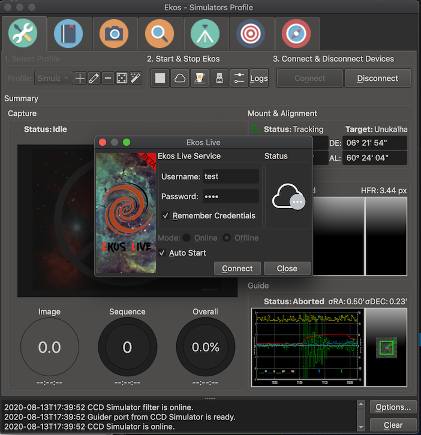
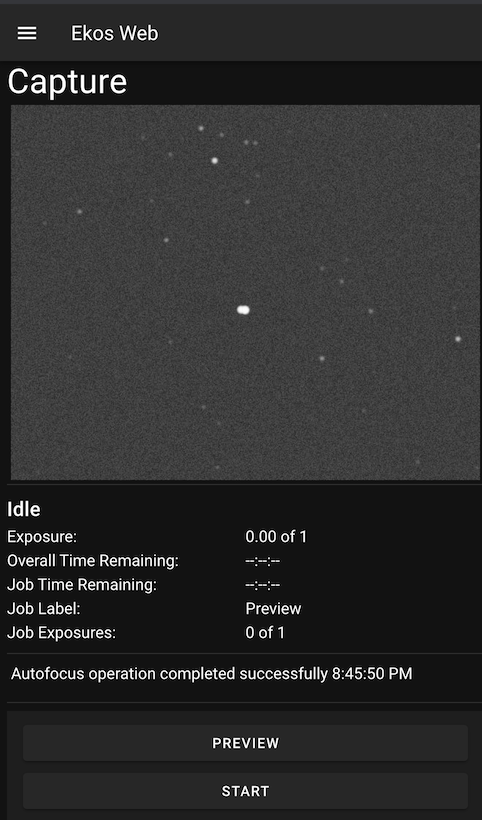
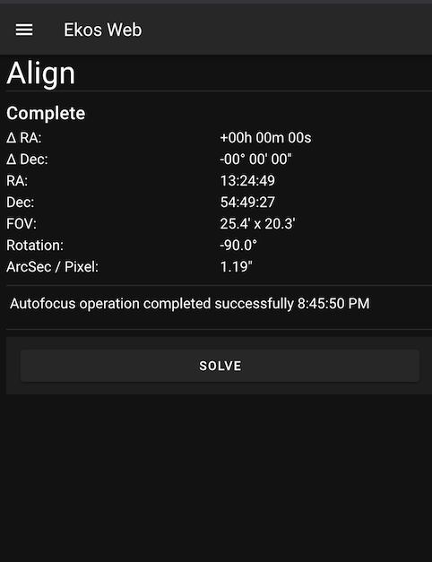
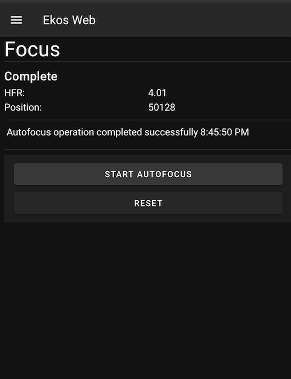
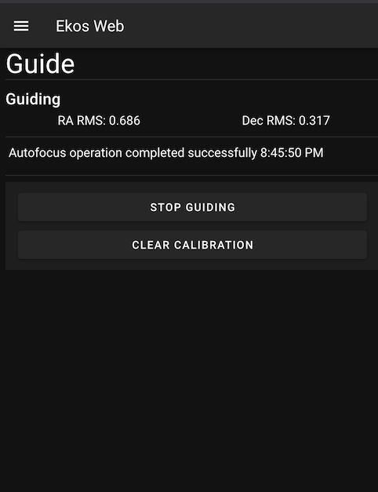
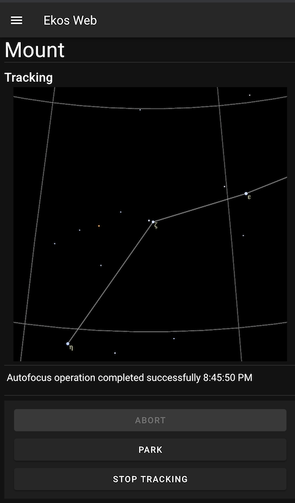
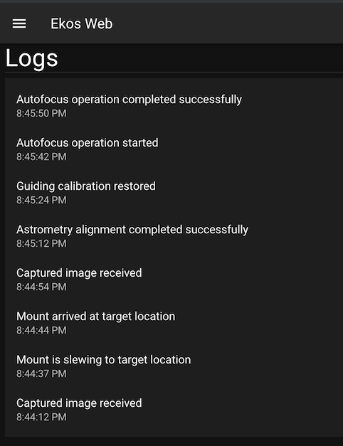

# ekos-web

A simple web server and client that listens for a connection from KStars Ekos
and provides an easy way to keep track of your astrophotography session from a
small screen.

You can now control simple things in Ekos, like capturing a preview image, start/stop
guiding, start/stop auto focus, sovle the current view, park/unpark the mount.

See screenshots below for more info.

## Installation

First checkout the code.

```bash
git clone https://github.com/rickbassham/ekos-web
cd ekos-web
```

### Docker

Checkout the code from the repo, build the docker image, and run.

```bash
docker build -t ekos-web .
docker run -p 3000:3000 -it ekos-web
```

### Manual

You need node.js installed to run manually.

```bash
cd client
npm install
npm run build
cp -r dist/ ../server/static
cd ../server
npm install
node index.js
```

After you have it running, you can visit http://localhost:3000 to view the page.



Now launch KStars and Ekos as usual, but now you'll need to connect to KStars Live
in offline mode.





The username and password you use here don't matter, they are ignored by this app.

Now connect to you equipment in Ekos as usual and start your astrophotography
session.

You can keep an eye on your equipment now on your smartphone or tablet by browsing to your
imaging computer's address. For me, it would be http://rick-astrobuntupi:3000.

Here are a few more shots with examples.







